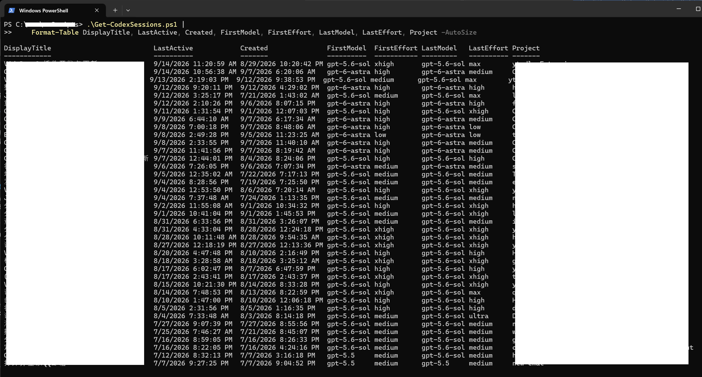
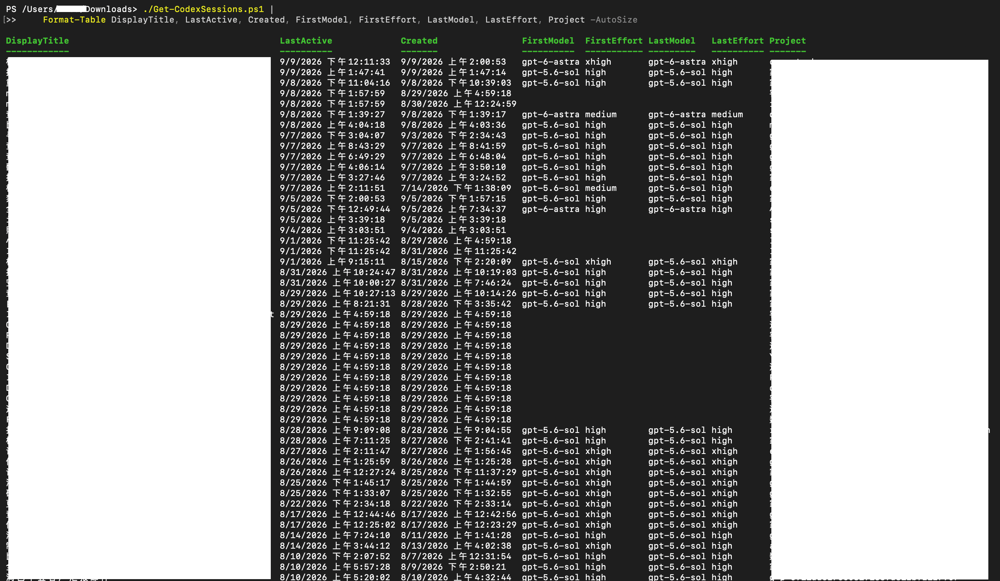

English | [简体中文](README.zh-CN.md)

# Get-CodexSessions

A cross-platform PowerShell utility for inspecting local Codex sessions and identifying the model originally used by each session.

## Why this tool exists

After GPT-6 Astra became available, Codex could display a warning that switching an existing session from a GPT-5.6-series model might degrade output quality. That practical situation created a simple question to answer before continuing the old session, changing its model, or starting a new one: which model did this Codex session actually start with?

Get-CodexSessions was built to answer that question from local Codex metadata. This is the project's development motivation and a practical use case; it is not a claim that every model switch has compatibility problems or that every switched session will produce lower-quality output.

## Features

The script reads and displays:

- Session title and a shortened display title
- Creation time and last-active time
- Session ID
- `FirstModel` and `FirstEffort`
- `LastModel` and `LastEffort`
- Project and working directory (`CWD`)
- The corresponding rollout JSONL path

This makes it easier to determine whether a session changed models or reasoning effort, locate its rollout file, list sessions for a project, and distinguish normal user sessions from Codex helper threads.

By default, the script filters internal threads such as `codex-auto-review`, Guardian, Sub-agent, child threads, and internal review or approval threads. Use `-IncludeInternal` when those threads are relevant to your inspection.

## Output examples

### Windows



### macOS



## Requirements

| Platform | PowerShell |
|---|---|
| Windows | Windows PowerShell 5.1 or PowerShell 7.x |
| macOS | <a href="https://learn.microsoft.com/en-us/powershell/scripting/install/install-powershell-on-macos" target="_blank" rel="noopener noreferrer">PowerShell 7.x</a> |
| Linux | PowerShell 7.x; compatible by design, but not currently claimed as tested on Linux |

The default Codex Home is `C:\Users\<User>\.codex` on Windows and `/Users/<User>/.codex` on macOS. The script uses `$HOME` to handle the platform-specific user directory.

## Tested environments

- Windows: validated during the v1.0 release with Windows PowerShell 5.1 and PowerShell 7.x.
- macOS: tested on macOS Tahoe 26.2 with PowerShell 7.x. This confirms the script works in that tested environment, but does not guarantee compatibility with every macOS version.

## Installation

No traditional installation is required. Download [Get-CodexSessions.ps1](Get-CodexSessions.ps1), place it in any directory, and run it with a supported PowerShell version.

Windows execution policy settings may affect locally downloaded `.ps1` files. Follow your organization's security policy; this project does not require lowering the system-wide execution policy.

## Quick start

### Show normal Codex sessions

Windows:

```powershell
.\Get-CodexSessions.ps1 |
    Format-Table DisplayTitle, LastActive, Created, FirstModel, FirstEffort, LastModel, LastEffort, Project -AutoSize
```

macOS:

```powershell
./Get-CodexSessions.ps1 |
    Format-Table DisplayTitle, LastActive, Created, FirstModel, FirstEffort, LastModel, LastEffort, Project -AutoSize
```

### Find sessions by title

```powershell
.\Get-CodexSessions.ps1 |
    Where-Object { $_.Title -like "*VidzDown*" } |
    Format-Table DisplayTitle, LastActive, Created, FirstModel, FirstEffort, LastModel, LastEffort, Project -AutoSize
```

### Show all details for a session

```powershell
.\Get-CodexSessions.ps1 |
    Where-Object { $_.Title -like "*VidzDown*" } |
    Format-List *
```

### Inspect Codex internal threads

```powershell
.\Get-CodexSessions.ps1 -IncludeInternal |
    Where-Object { $_.IsInternal } |
    Format-Table DisplayTitle, LastActive, FirstModel, InternalReason, Project -AutoSize
```

On macOS, replace the initial `.\` with `./`; the remaining PowerShell pipeline syntax is the same.

## Full usage guide

The independent guides cover single- and multi-keyword filtering, OR and AND searches, Project, CWD and Session ID filters, sorting, recent sessions, model or reasoning-effort changes, model filters, internal-thread analysis, custom Codex Home directories, CSV export, JSONL lookup, Windows Explorer, and macOS Finder.

- [Full usage guide in English](Get-CodexSessions-Usage-en.md)
- [完整中文使用说明](Get-CodexSessions-Usage-zh-CN.md)

## How it works

Get-CodexSessions reads local Codex data from:

- `~/.codex/session_index.jsonl` for session titles and selected thread metadata
- `~/.codex/state_5.sqlite` as an optional supplemental title source when `sqlite3` is available
- `~/.codex/sessions/.../rollout-*.jsonl` for actual `turn_context`, model, reasoning effort, timestamps, working directory, and related metadata

SQLite is opened explicitly in read-only mode. If `sqlite3` is unavailable or the optional database lookup fails, session-index and rollout processing continue.

Codex's internal storage formats may change in future versions, so a future Codex update may require corresponding parser updates.

## Safety

Get-CodexSessions is a read-only inspection tool. It does not modify, delete, rename, or move Codex sessions, rollout JSONL files, `session_index.jsonl`, `state_5.sqlite`, or Codex configuration.

The tool reads local session metadata, which can contain private titles, prompts, paths, and project names. Review output before sharing or exporting it.

## Compatibility

- Windows PowerShell 5.1
- PowerShell 7.x on Windows
- PowerShell 7.x on macOS
- PowerShell 7.x on Linux by code design; Linux has not been claimed as an actually tested environment for v1.0

## License

This project is licensed under the [GNU General Public License v3.0 only](LICENSE) (`GPL-3.0-only`).
