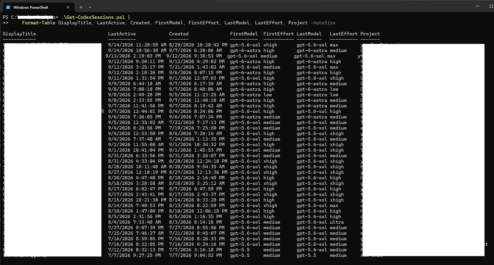
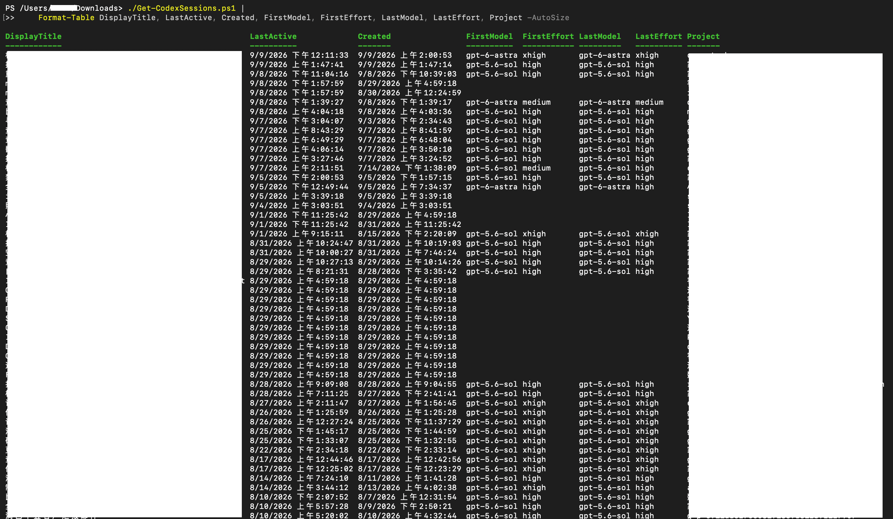

<div align="center">
  
  <h1>Get-CodexSessions</h1>
  <p>A cross-platform PowerShell utility for inspecting local Codex sessions and identifying the model originally used by each session.</p>
  <p>
    <a href="https://github.com/zjwww/Get-CodexSessions/releases/latest"></a>
    
    
    <a href="LICENSE"></a>
  </p>
  <p>
    <strong>English</strong>｜<a href="README.zh-CN.md">简体中文</a>｜<a href="https://github.com/zjwww/Get-CodexSessions/releases/latest">Download Latest</a>｜<a href="https://github.com/zjwww/Get-CodexSessions/issues">Report an Issue</a>
  </p>
</div>

## Why this tool exists

After GPT-6 Astra became available, Codex could display a warning that switching an existing session from a GPT-5.6-series model might degrade output quality. That practical situation created a simple question to answer before continuing the old session, changing its model, or starting a new one: which model did this Codex session actually start with?

Get-CodexSessions was built to answer that question from local Codex metadata. This is the project's development motivation and a practical use case; it is not a claim that every model switch has compatibility problems or that every switched session will produce lower-quality output.

## Features

The script reads and displays:

- Session title and a shortened display title
- Creation time and last-active time
- Session ID
- `FirstModel` and `FirstEffort`
- `LastModel` and `LastEffort`, with ` *` appended when they differ from their corresponding first values
- Raw unmarked values in `LastModelRaw` and `LastEffortRaw` for exact filtering and export
- Project name, Project ID, project root path, and working directory (`CWD`)
- The corresponding rollout JSONL path
- Optional terminal-only highlighting for standalone-session rows, with caller-selected columns and foreground color

This makes it easier to determine whether a session changed models or reasoning effort, locate its rollout file, list sessions for a project, and distinguish normal user sessions from Codex helper threads.

When Codex project metadata is available, `Project` contains the saved project name and the script also returns `ProjectId`, `ProjectPath`, and `ProjectSource`. A session without a formal project assignment is labeled `<Standalone Session>`; its `ProjectId` is `<N/A>`, its `ProjectPath` is the complete recorded `CWD`, and its `ProjectSource` is `standalone`.

When a session's last model differs from its first model, `LastModel` ends with ` *`. `LastEffort` uses the same marker when the reasoning effort changed. Use `LastModelRaw` and `LastEffortRaw` whenever an exact unmarked value is needed for filtering or export.

By default, the script filters internal threads such as `codex-auto-review`, Guardian, Sub-agent, child threads, and internal review or approval threads. Use `-IncludeInternal` when those threads are relevant to your inspection.

While rollout files are being scanned, the script displays host-native overall progress using the standard PowerShell `Write-Progress` command. Windows PowerShell 5.1 and PowerShell 7.x use their own default presentation styles. Use `-NoProgress` to suppress progress output in automation or other non-interactive scenarios.

For larger session stores, the script uses an in-memory compiled pre-scanner to skip unrelated JSONL records before PowerShell parses the required metadata. This optimization is read-only, requires no external dependency, and automatically falls back to the standard PowerShell reader if compilation is unavailable.

## Output examples

These historical screenshots illustrate the terminal presentation; they do not show the new v1.6 fields or establish native macOS verification for v1.6.

### Windows



### macOS



## Requirements

| Platform | PowerShell |
|---|---|
| Windows | Windows PowerShell 5.1 or PowerShell 7.x |
| macOS | [PowerShell 7.x](https://learn.microsoft.com/en-us/powershell/scripting/install/install-powershell-on-macos) |
| Linux | PowerShell 7.x; compatible by design, but not currently claimed as tested on Linux |

The default Codex Home is `C:\Users\<User>\.codex` on Windows and `/Users/<User>/.codex` on macOS. The script uses `$HOME` to handle the platform-specific user directory.

## Tested environments

- Windows: validated with Windows PowerShell 5.1 and the Codex-bundled PowerShell 7.6.5 runtime. This confirms PowerShell 7 engine compatibility; it is not evidence of a separate system-wide PowerShell 7 installation.
- macOS: v1.6 was statically reviewed for macOS PowerShell 7 compatibility; native macOS runtime remains unverified. Historical runtime evidence for macOS Tahoe 26.2 with PowerShell 7.x belongs to v1.0 only.

## Installation

No traditional installation is required. Download [Get-CodexSessions-v1.6.ps1](Get-CodexSessions-v1.6.ps1), place it in any directory, and run it with a supported PowerShell version.

Windows execution policy settings may affect locally downloaded `.ps1` files. Follow your organization's security policy; this project does not require lowering the system-wide execution policy.

## Quick start

### Show normal Codex sessions

Windows:

```powershell
.\Get-CodexSessions-v1.6.ps1 |
    Format-Table DisplayTitle, LastActive, Created, FirstModel, FirstEffort, LastModel, LastEffort, Project -AutoSize
```

macOS:

```powershell
./Get-CodexSessions-v1.6.ps1 |
    Format-Table DisplayTitle, LastActive, Created, FirstModel, FirstEffort, LastModel, LastEffort, Project -AutoSize
```

### Highlight standalone sessions in the terminal

`-ColorOutput` is an optional display-only mode. Standalone-session rows are yellow by default, and `-Property` selects and orders the displayed columns:

```powershell
.\Get-CodexSessions-v1.6.ps1 `
    -ColorOutput `
    -Property DisplayTitle, LastActive, Project, ProjectId, ProjectPath
```

Use `-StandaloneColor` with a `ConsoleColor` name to choose another foreground color. The default object mode remains unchanged for `Format-Table`, filtering, sorting, and export pipelines.

### Find sessions by title

```powershell
.\Get-CodexSessions-v1.6.ps1 |
    Where-Object { $_.Title -like "*SampleProject*" } |
    Format-Table DisplayTitle, LastActive, Created, FirstModel, FirstEffort, LastModel, LastEffort, Project -AutoSize
```

### Show all details for a session

```powershell
.\Get-CodexSessions-v1.6.ps1 |
    Where-Object { $_.Title -like "*SampleProject*" } |
    Format-List *
```

### Inspect Codex internal threads

```powershell
.\Get-CodexSessions-v1.6.ps1 -IncludeInternal |
    Where-Object { $_.IsInternal } |
    Format-Table DisplayTitle, LastActive, FirstModel, InternalReason, Project -AutoSize
```

On macOS, replace the initial `.\` with `./`; the remaining PowerShell pipeline syntax is the same.

## Full usage guide

The independent guides cover single- and multi-keyword filtering, OR and AND searches, Project, CWD and Session ID filters, sorting, recent sessions, model or reasoning-effort changes, model filters, internal-thread analysis, custom Codex Home directories, CSV export, JSONL lookup, Windows Explorer, and macOS Finder.

- [Full usage guide in English](Get-CodexSessions-Usage-en.md)
- [完整中文使用说明](Get-CodexSessions-Usage-zh-CN.md)
- [Changelog](CHANGELOG.md)
- [中文更新日志](CHANGELOG.zh-CN.md)

## How it works

Get-CodexSessions reads local Codex data from:

- `~/.codex/session_index.jsonl` for session titles and selected thread metadata
- `~/.codex/.codex-global-state.json` for saved project definitions and thread-to-project assignments when available
- `~/.codex/state_5.sqlite` as an optional supplemental title and formal project-assignment source when `sqlite3` is available
- `~/.codex/sessions/.../rollout-*.jsonl` for actual `turn_context`, model, reasoning effort, timestamps, working directory, and related metadata

SQLite is opened explicitly in read-only mode. If `sqlite3` is unavailable or the optional database lookup fails, session-index and rollout processing continue.

Codex's internal storage formats may change in future versions, so a future Codex update may require corresponding parser updates.

## Safety

Get-CodexSessions is a read-only inspection tool. It does not modify, delete, rename, or move Codex sessions, rollout JSONL files, `session_index.jsonl`, `state_5.sqlite`, or Codex configuration.

The tool reads local session metadata, which can contain private titles, prompts, paths, and project names. Review output before sharing or exporting it.

## Compatibility

- Windows PowerShell 5.1
- PowerShell 7.x on Windows
- PowerShell 7.x on macOS
- PowerShell 7.x on Linux by code design; Linux has not been claimed as an actually tested environment for v1.6

## License

This project is licensed under the [GNU General Public License v3.0 only](LICENSE) (`GPL-3.0-only`).
